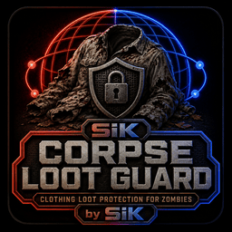

# SiK Corpse Loot Guard

SiK Corpse Loot Guard is a diagnostics-only Project Zomboid utility. It captures
zombie inventory state before death, correlates client, authoritative and corpse
stages, distinguishes apparent loss from later movement, and writes bounded
evidence. It does not create, delete, move or restore items.

| Version | Mod ID | Workshop ID | Build | Dependency |
| --- | --- | --- | --- | --- |
| 0.2.12 | SiKCorpseLootGuard | [3774808073](https://steamcommunity.com/sharedfiles/filedetails/?id=3774808073) | 42.20+ | None |

Subscribe through Workshop and enable it where the suspected corpse-loss case
can be reproduced. It supports SP, host and dedicated/client diagnostics, but
the underlying reported loss is primarily an MP investigation.

Read [diagnostics](docs/DEBUGGING.md),
[case interpretation](docs/CASES_AND_RECOVERY.md) and the public
[SCLGSiK.API](docs/SCLGSiK_API.md). Active recovery is deliberately disabled.

Report reproducible cases at
[GitHub Issues](https://github.com/Kavalieri/SiKCorpseLootGuard/issues) with
version, environment, outfit/mod combination, steps and redacted relevant
traces. Do not post credentials or exploitable authority details publicly.

## Español

SiK Corpse Loot Guard es una utilidad exclusivamente diagnóstica. Captura el
inventario del zombi antes de morir, correlaciona cliente, autoridad y cadáver,
distingue pérdidas aparentes de movimientos posteriores y guarda evidencia
acotada. No crea, borra, mueve ni restaura objetos.

Requiere Build 42.20+ y no tiene dependencias. Cubre rutas SP, host y
dedicado/cliente, aunque el fallo investigado se observa principalmente en MP.
La recuperación activa permanece deshabilitada.

## ❤️ Support development

SiK mods remain free. Voluntary support through
[GitHub Sponsors](https://github.com/sponsors/Kavalieri) does not unlock
features, exclusive gameplay, priority or guaranteed support.

## ❤️ Apoya el desarrollo

Global Storage SiK y sus addons son gratuitos y seguirán siéndolo. Si quieres
apoyar su desarrollo, pruebas y mantenimiento, puedes hacerlo mediante
[GitHub Sponsors](https://github.com/sponsors/Kavalieri).

El apoyo es completamente voluntario y no desbloquea funciones, contenido ni
ventajas de juego exclusivas.

## Licence and notices

See [LICENSE.md](LICENSE.md), [NOTICE.md](NOTICE.md),
[CONTRIBUTING.md](CONTRIBUTING.md), [SECURITY.md](SECURITY.md),
[MAINTENANCE_STATUS.md](MAINTENANCE_STATUS.md) and
[THIRD_PARTY_NOTICES.md](THIRD_PARTY_NOTICES.md).

This project uses AI assistance, including Codex and Claude, during parts of
design, documentation and development. Product decisions, review and
publication remain with the SiK team.
